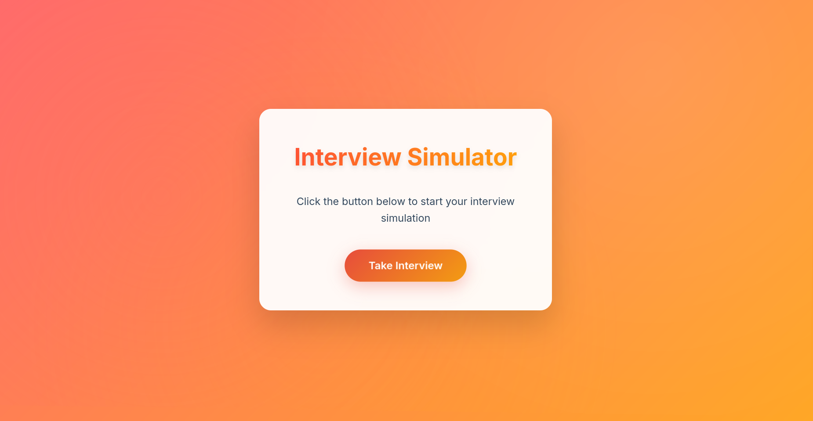
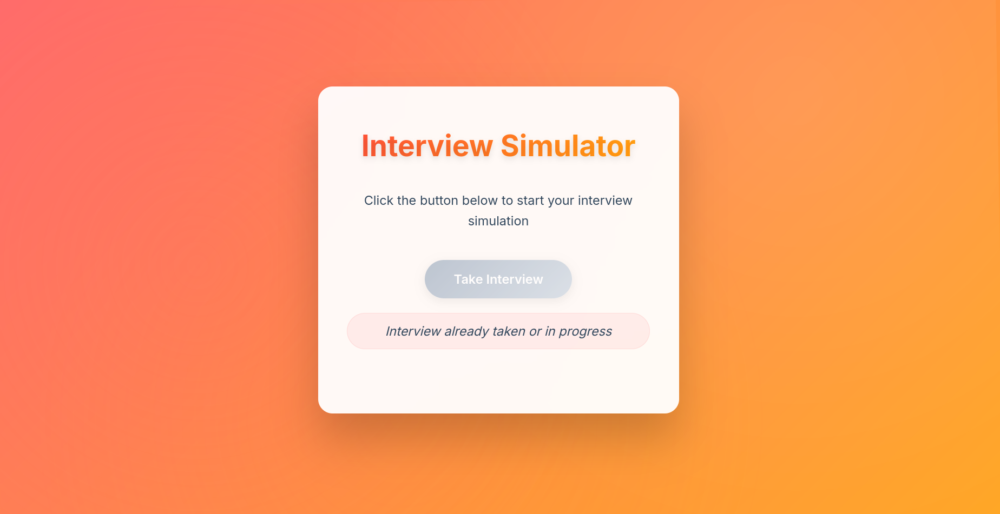
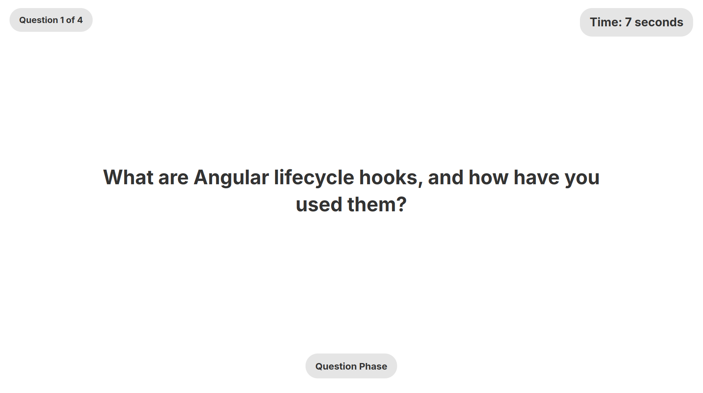
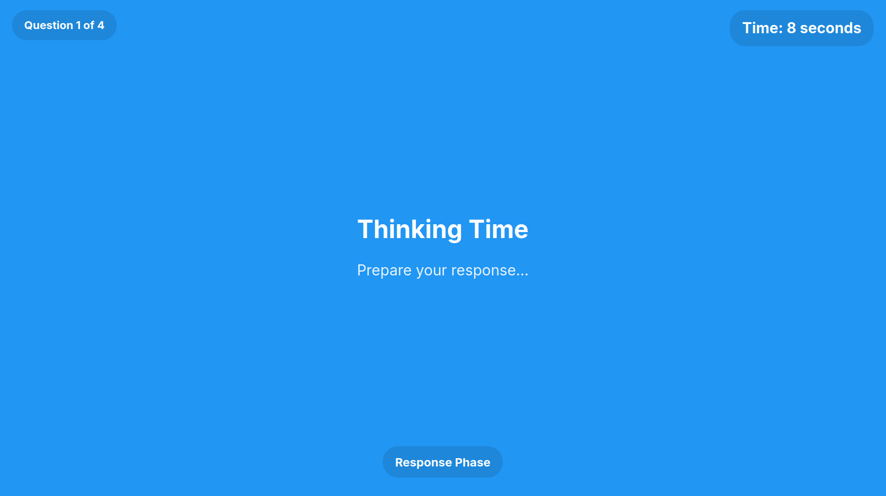
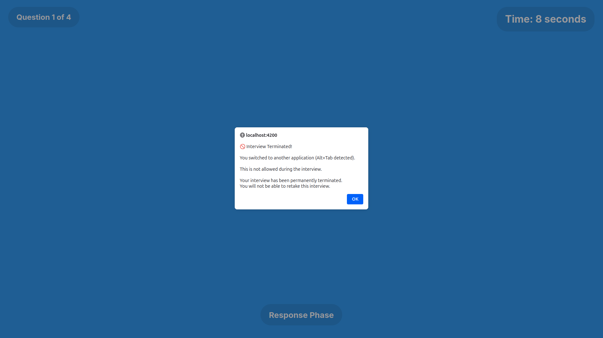
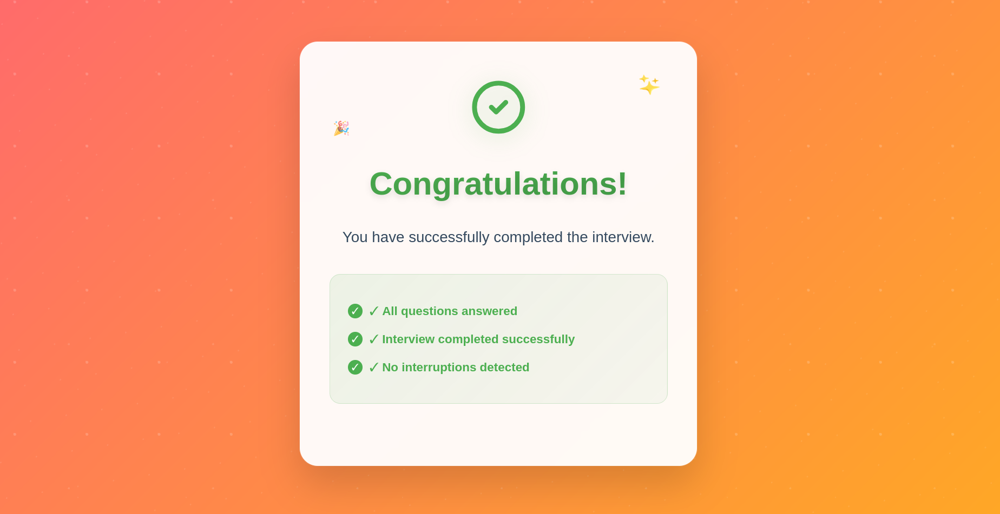

# Interview Simulator

A professional Angular application that simulates a secure interview environment with strict security measures and modern UI/UX design.

## 🚀 Features

### 1. **Home Page - Single Entry Point**
- **One-time use button**: "Take Interview" button can only be clicked once
- **Persistent state**: Button remains disabled even after browser refresh (localStorage)
- **Modern UI**: Beautiful gradient background with animated particles and glassmorphism effects
- **Professional styling**: Responsive design with hover effects and smooth animations


*Home page with the "Take Interview" button ready to use*


*Home page after the interview has been taken - button permanently disabled*

### 2. **Interview Mode - Secure Full-Screen Experience**
- **Automatic full-screen**: Interview starts in full-screen mode
- **Countdown timer**: Visible timer showing remaining time
- **4 Random questions**: Questions loaded from JSON file, displayed one at a time
- **10-second display**: Each question shown for exactly 10 seconds
- **10-second thinking time**: Blue background transition after each question
- **Strict security**: Any attempt to leave tab, switch windows, minimize, or open dev tools terminates the interview


*Question display phase with countdown timer*


*Thinking phase with blue background transition*

### 3. **Security Termination**
- **Comprehensive protection**: Detects tab switches, window blur, minimize, close attempts, dev tools, etc.
- **Immediate termination**: Interview ends permanently if any security violation occurs
- **User-friendly alerts**: Clear popups explain security violations


*Security violation popup when interview is terminated*

### 4. **Success Page - Completion Confirmation**
- **Achievement celebration**: Animated success message with checkmark
- **Completion details**: Shows interview statistics and confirmation
- **Route protection**: No way to retake the interview once completed


*Success page after completing the interview*

### 5. **Route Guards - Flow Protection**
- **Strict navigation**: Route guards prevent unauthorized access to interview/success pages
- **State persistence**: User state maintained across browser sessions
- **No backtracking**: Once completed, user cannot return to previous stages

## 🛠️ Technical Architecture

### **Components Generated via Angular CLI**
```bash
# All components created using Angular CLI
ng generate component home
ng generate component interview  
ng generate component success
ng generate service services/interview
ng generate guard guards/home
ng generate guard guards/interview
ng generate guard guards/success
```

### **Key Technical Features**
- **Angular 19**: Latest Angular framework
- **TypeScript**: Strict type safety
- **RxJS**: Reactive programming for data streams
- **Route Guards**: CanActivate guards for flow control
- **Local Storage**: Persistent state management
- **Responsive Design**: Mobile-first approach
- **Modern CSS**: Gradients, animations, glassmorphism effects

## 📁 Project Structure

```
interview-simulator/
├── src/
│   ├── app/
│   │   ├── components/
│   │   │   ├── home/
│   │   │   │   ├── home.component.ts
│   │   │   │   ├── home.component.html
│   │   │   │   └── home.component.css
│   │   │   ├── interview/
│   │   │   │   ├── interview.component.ts
│   │   │   │   ├── interview.component.html
│   │   │   │   └── interview.component.css
│   │   │   └── success/
│   │   │       ├── success.component.ts
│   │   │       ├── success.component.html
│   │   │       └── success.component.css
│   │   ├── services/
│   │   │   └── interview.service.ts
│   │   ├── guards/
│   │   │   ├── home.guard.ts
│   │   │   ├── interview.guard.ts
│   │   │   └── success.guard.ts
│   │   ├── app.routes.ts
│   │   └── app.config.ts
│   └── assets/
│       └── questions-response.json
├── Screenshots/
└── README.md
```

## 🔧 Installation & Setup

### Prerequisites
- Node.js (version 18 or higher)
- npm or yarn package manager
- Angular CLI

### Step 1: Clone the Repository
```bash
git clone https://github.com/abderrahmenyoussef/Interview-Simulation-UI.git
cd interview-simulator
```

### Step 2: Install Dependencies
```bash
npm install
```

### Step 3: Run the Application
```bash
# Development server
npm start
# or
ng serve

# The application will be available at http://localhost:4200
```

### Step 4: Build for Production
```bash
# Build the project
npm run build
# or
ng build --prod

# The build artifacts will be stored in the `dist/` directory
```

## 🎯 How to Use

1. **Start the Application**: Navigate to `http://localhost:4200`
2. **Take the Interview**: Click the "Take Interview" button (only works once)
3. **Complete the Interview**: Answer 4 questions without leaving the tab
4. **View Results**: See the success message upon completion

## 🔒 Security Features

### Interview Termination Triggers
- Tab switching (`visibilitychange` event)
- Window blur (`blur` event)
- Window minimize detection
- Attempt to close window (`beforeunload` event)
- Developer tools detection
- Context menu blocking
- Keyboard shortcut blocking (F12, Ctrl+Shift+I, etc.)

### User Experience
- **Comprehensive popups**: Clear explanations for all security violations
- **One-time alerts**: Single popup per violation type to avoid spam
- **Graceful termination**: Smooth transition to termination state

## 🎨 UI/UX Design Features

### Modern Design Elements
- **Gradient backgrounds**: Dynamic orange/red gradients
- **Glassmorphism**: Frosted glass effect on cards
- **Animations**: Smooth transitions and hover effects
- **Responsive design**: Mobile-friendly layout
- **Professional typography**: Clean, readable fonts
- **Loading states**: Animated loading indicators

### Color Scheme
- **Primary**: Warm orange/red gradient (`#ff6b6b` to `#ffa726`)
- **Accent**: Red/orange buttons (`#e74c3c` to `#f39c12`)
- **Success**: Green theme (`#4CAF50` to `#45a049`)
- **Text**: Dark readable colors (`#2c3e50`, `#34495e`)

## 📊 Development Notes

### Architecture Decisions
1. **Component-based structure**: Each major view is a separate component
2. **Service-driven data**: Interview questions managed through dedicated service
3. **Guard-protected routes**: Strict navigation control via route guards
4. **Local storage persistence**: User state maintained across sessions
5. **No fallback questions**: Only loads from JSON file (with error handling)

### Security Implementation
- **Multiple event listeners**: Comprehensive detection of user attempts to leave
- **Immediate termination**: No second chances for security violations
- **Persistent state**: Once terminated, cannot be reset without clearing browser data

### Performance Considerations
- **Lazy loading**: Components loaded as needed
- **Efficient animations**: Hardware-accelerated CSS transitions
- **Minimal bundle size**: Only essential dependencies included

## 🚀 Future Enhancements (Optional)

### Potential Improvements
1. **Audio/Video Recording**: Record candidate responses
2. **Multiple Question Sets**: Different difficulty levels
3. **Admin Dashboard**: Interview management interface
4. **Results Analytics**: Performance tracking and analysis
5. **Multi-language Support**: Internationalization
6. **AI Integration**: Automated response evaluation
7. **Calendar Integration**: Schedule interviews
8. **Export Functionality**: PDF reports generation

### Technical Improvements
- **Unit Tests**: Comprehensive test coverage
- **E2E Testing**: End-to-end test scenarios
- **PWA Features**: Offline capability
- **Server-side Rendering**: Better SEO and performance
- **Database Integration**: Persistent data storage
- **User Authentication**: Login/registration system


